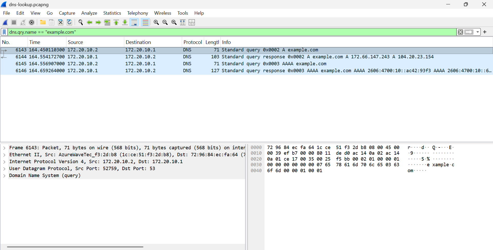
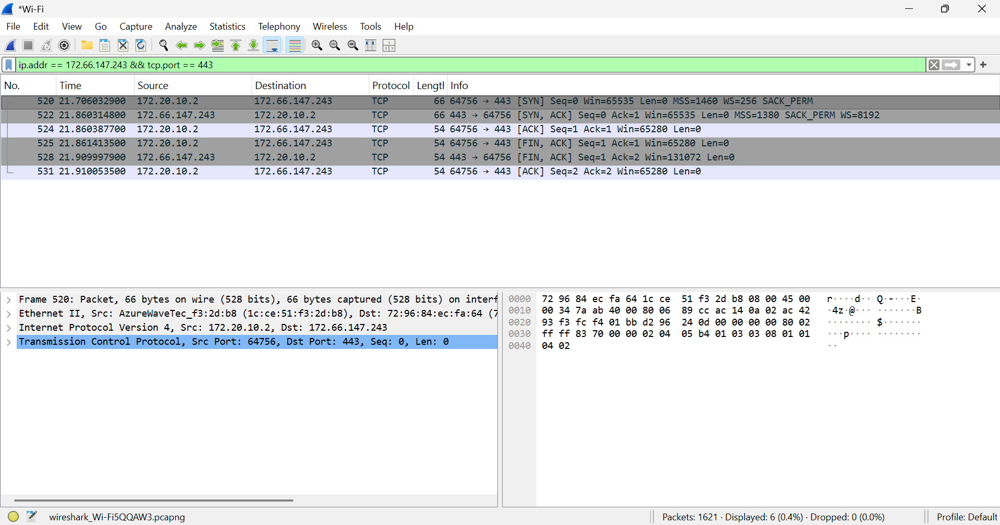

# Wireshark DNS and TCP Investigation

## Overview
I used Wireshark and Windows PowerShell to capture and analyze a DNS lookup and a TCP connection test. My goal was to understand how a domain resolves to IP addresses and how a TCP connection opens and closes.

## Tools
- Wireshark
- Windows PowerShell
- Windows computer using Wi-Fi

## 1. DNS Lookup

While capturing traffic, I ran:

    nslookup example.com

I stopped the capture and applied this Wireshark display filter:

    dns.qry.name == "example.com"

### Findings
- My computer sent DNS queries to the local DNS server at `172.20.10.1`.
- The filtered capture showed four packets: an A query and response, followed by an AAAA query and response.
- The A response returned IPv4 addresses `172.66.147.243` and `104.20.23.154`.
- The AAAA response returned IPv6 addresses.

A records provide IPv4 addresses, while AAAA records provide IPv6 addresses.

### Screenshot

## 2. TCP Connection Test

During a separate capture, I ran:

    Test-NetConnection 172.66.147.243 -Port 443

PowerShell reported:

    TcpTestSucceeded : True

I stopped the capture and applied this display filter:

    ip.addr == 172.66.147.243 && tcp.port == 443

### Findings
The filter showed six packets:

| Frame | Direction | TCP flags | Meaning |
| --- | --- | --- | --- |
| 520 | Computer → server | SYN | Requested a connection |
| 522 | Server → computer | SYN, ACK | Acknowledged the request and requested a connection |
| 524 | Computer → server | ACK | Completed the handshake |
| 525 | Computer → server | FIN, ACK | Started closing the connection |
| 528 | Server → computer | FIN, ACK | Acknowledged closure and closed its side |
| 531 | Computer → server | ACK | Completed the close |

The first three packets show the TCP three-way handshake. The remaining packets show an orderly connection close.

### Screenshot

## What I Learned
- How to capture traffic and apply Wireshark display filters.
- How to identify DNS queries, responses, and record types.
- How to recognize TCP connection establishment and termination.
- How to compare PowerShell results with packet evidence.

## Limitations
This test confirmed TCP connectivity to port 443. It did not test webpage loading, validate TLS encryption, or determine whether the server was secure.

The original captures remain local because they contain unrelated background traffic.
